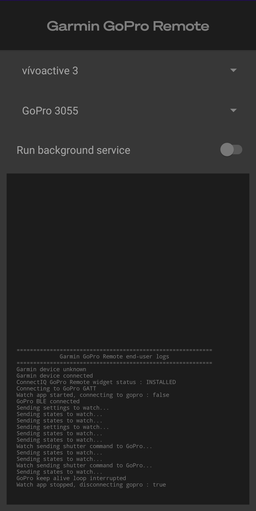

# Companion app for the GoPro remote on Garmin watch

An Android app used as a bridge between a GoPro and the [ConnectIQ widget](https://github.com/ad220/gopro-remote-connectiq) which acts as a remote for the camera. Uses the [Open GoPro Bluetooth Low Energy API](https://gopro.github.io/OpenGoPro/ble_2_0) and the [Garmin ConnectIQ Mobile SDK](https://developer.garmin.com/connect-iq/overview/).

Please note that the app is still under development and while this should be stable enough to play with, it may still encounter a few bugs.

## Features
- pick the watch you want to use from all paired devices on the ConnectIQ app
- choose the GoPro to connect to from all paired cameras on your phone
- log the connection and message history to UI.
- background service to keep the bridge on while app closed

## Installation
I did not released this on the Play Store for now. You can use Android Studio to build, install and run the app on a connected smartphone with USB debugging on, or you can install the release provided on GitHub.

For now, the location permission must be given through the settings (asking on first app launch not implemented yet), as it is required to scan for bluetooth devices.

## How to use it
Make sure you have Garmin ConnectIQ app installed on your phone and that your watch is paired to it (that should not be a problem as it is the proper way to sync your watch). 

Pair the GoPro to your smartphone using the GoPro Quik app or just by scanning for it in the Android bluetooth settings.

Launch the companion app, make sure the selected devices are the ones you want to use. You are now ready to use the widget on your watch.